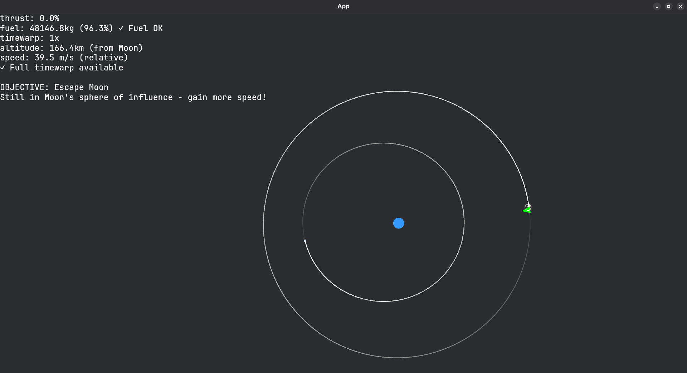
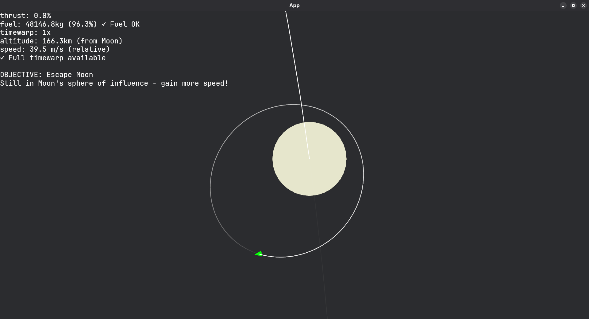

# WA3 Reflection

## Educational Concept & Target Audience

### What math, science, or natural topic does your simulation teach?

This simulation teaches orbital mechanics and rocket physics, providing hands-on experience with real-world space navigation concepts.

### How is it adapted for beginner, intermediate, and advanced audiences?

* **Beginner:** The simulation starts with a simple objective - escape the Moon's gravity well. All controls are clearly displayed on screen, and the trajectory prediction helps visualize where the spacecraft will go. The physics simulation handles the complex orbital mechanics automatically.
* **Intermediate:** Once escaped from the Moon, learners must navigate to Earth and achieve a stable Low Earth Orbit (LEO). This requires understanding orbital velocity, altitude management, and fuel conservation while dealing with multiple gravitational bodies.
* **Advanced:** The final challenge involves performing a controlled landing on Earth, which requires precise velocity control, understanding atmospheric entry (simulated through altitude restrictions), and managing fuel reserves throughout the entire multi-stage mission.

### Elaborate on learning objectives for each audience level.

* **Beginner:** Learn basic spacecraft control and achieve escape velocity from the Moon
* **Intermediate:** Master interplanetary navigation and achieve stable Earth orbit  
* **Advanced:** Execute complex mission planning including controlled atmospheric entry and landing

---

## How does your simulation facilitate learning?

### What interactive elements promote exploration?

The simulation features open-world mechanics that allow users to freely navigate their spacecraft anywhere in the simulation environment. Key interactive features include:

* **Real-time trajectory prediction** - Shows future orbital path to help plan maneuvers
* **Multi-body gravitational system** - Earth, Luna (large moon), and Europa (smaller moon) create complex orbital dynamics
* **Fuel management** - Limited fuel forces strategic thinking about when and how much to thrust
* **Time warp controls** - Speed up simulation with `[` and `]` keys (automatically restricted near celestial bodies for safety)
* **Live feedback** - Real-time UI showing altitude, speed, fuel status, and current objective progress
* **Progressive objectives** - Clear goals guide learning from simple escape to complex orbital mechanics

---

## Design Documentation

### Your planning process, including any diagrams, sketches, or descriptions

Initially, I planned to demonstrate only gravity slingshot mechanics, but I later decided to expand the scope to create a more complete learning experience. I sketched out the UI layout and designed different complexity levels for each target audience.

### UI/UX design considerations for different audience levels

Since orbital mechanics is inherently complex, I chose to display the same essential information to all audience levels. The information provided is minimal and focused, ensuring it won't overwhelm beginners while still being useful for advanced users.

### How you applied the PhET guidelines mentioned in the spec, if any (reference specific principles)

While I didn't explicitly follow the PhET guidelines during development, I incorporated several key principles: making the simulation highly interactive and engaging, ensuring controls are intuitive and easy to learn, and providing immediate visual feedback for all user actions.

### Did you try to get, and incorporate any feedback?

I conducted several playtesting sessions with friends to identify areas for improving the user experience. The main feedback centered on control sensitivity being too high, so I adjusted the response rates to make spacecraft control more manageable and precise.

---

## Implementation Overview

### How it works

This simulation is a 2D N-body gravitational simulator where users control a spacecraft to explore the Earth-Moon system and learn orbital mechanics through hands-on experience.

### List features for each audience level

* **Beginner:**
    * Simple escape objective from Moon surface
    * Clear visual trajectory prediction lines
    * Real-time UI showing essential information (fuel, thrust, altitude)
    * Automatic gravity and physics calculations
    * Forgiving collision detection and physics

* **Intermediate:**
    * Multi-body orbital mechanics with Earth and two moons
    * Fuel consumption and management
    * Time warp controls for faster simulation
    * Earth orbit achievement challenge
    * Central body switching (Moon vs Earth sphere of influence)

* **Advanced:**
    * Precise landing mechanics requiring velocity control
    * Complex trajectory planning across multiple gravitational bodies
    * Fuel optimization across entire mission profile
    * Full N-body physics simulation with realistic orbital mechanics
    * Achievement of complete mission from Moon escape to Earth landing

### User controls: please provide a clear list of all keyboard/mouse controls

**Spacecraft Control:**
* `↑` Arrow Up - Increase thrust by 10% (up to 100%)
* `↓` Arrow Down - Decrease thrust by 10% (down to 0%)
* `←` Arrow Left - Rotate spacecraft counterclockwise (1° per press)
* `→` Arrow Right - Rotate spacecraft clockwise (1° per press)

**Time Management:**
* `[` Left Bracket - Decrease time warp (slower simulation)
* `]` Right Bracket - Increase time warp (faster simulation, up to 250,000x)
* Note: Time warp automatically restricted when near celestial bodies for safety

**Camera Controls:**
* `Mouse Wheel` - Zoom in/out (camera scale from 1x to 100,000x)
* `Left Mouse Drag` or `Middle Mouse Drag` - Pan camera around the simulation
* `C` - Recenter camera on spacecraft
* Camera automatically follows spacecraft with adjustable offset from panning

---

## Extensions & Creative Features

### Everything you did beyond the requirements!

* Full N-body gravitational simulation using Verlet integration for numerical accuracy
* Real-time trajectory prediction with adaptive timestep optimization
* Progressive objective system with three distinct difficulty levels
* Advanced camera system with automatic following and manual offset control
* Time warp system with altitude-based safety restrictions

## Screenshots and Demo

### Screenshots




### Demo video link


---

## Reflections:

### Final reflections

1. I learned that it's okay to pivot during development - initially I attempted to implement this using both p5.js and Rust, but found this approach overly complicated. Switching to a fully Rust-based solution proved much more effective.
2. I spent considerable time understanding numerical integration methods, as standard Euler integration wasn't accurate enough for realistic orbital mechanics. I also leveraged Rust's type system extensively to prevent runtime errors.
3. I applied several concepts from "The Nature of Code," particularly the gravitational force calculations and particle system dynamics.
4. This project sparked my interest in exploring functional programming languages, as they seem particularly well-suited for mathematical computations and data processing tasks.

### Course feedback
1. Consider including more practical applications (e.g., real-world scripts, tools, automation)
2. "The Nature of Code" effectively demonstrates programming's creative and scientific potential
3. I'd like to explore more applied programming domains in future courses
4. Specific interests include data science, cybersecurity, and systems programming


---

## Source Code

### Preview link
[GitHub Pages](https://netsbot.github.io/cepwa3-bevy)


### Include any special setup instructions if needed

For optimal performance, you can run the project natively:
```bash
git clone https://github.com/netsbot/cepwa3-bevy.git
cd cepwa3-bevy
cargo run
```

**Requirements:** Ensure you have the latest version of Rust installed on your system.

### GitHub link is optional but no harm adding to your portfolio!

https://github.com/netsbot/cepwa3-bevy

---

## Acknowledgments

### Cite all sources that inspired or influenced your project

[N-body problem - Nature of Code](https://natureofcode.com/forces/#the-n-body-problem)

[Bevy Cheat Book](https://bevy-cheatbook.github.io/introduction.html)

[Rocket engine sound effect](https://pixabay.com/sound-effects/rocket-loop-99748/)

[Bevy project template](https://github.com/NiklasEi/bevy_game_template)

### Technical references and learning resources

[Verlet integration algorithm](https://www.algorithm-archive.org/contents/verlet_integration/verlet_integration.html)

[Newton's Law of Universal Gravitation](https://en.wikipedia.org/wiki/Newton%27s_law_of_universal_gravitation)

### Include existing code, tutorials, your own prior projects, and any AI assistance

I used GitHub Copilot to generate boilerplate code for UI elements and world setup
